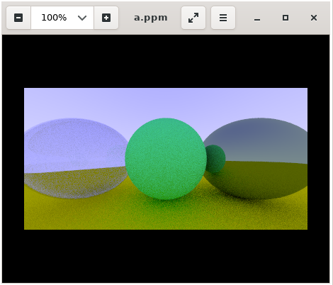
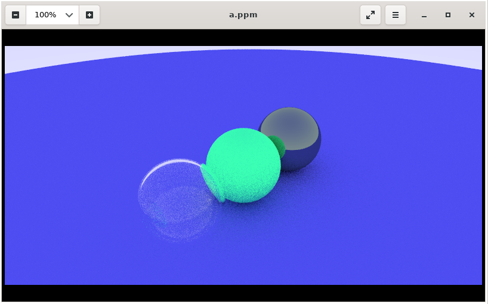
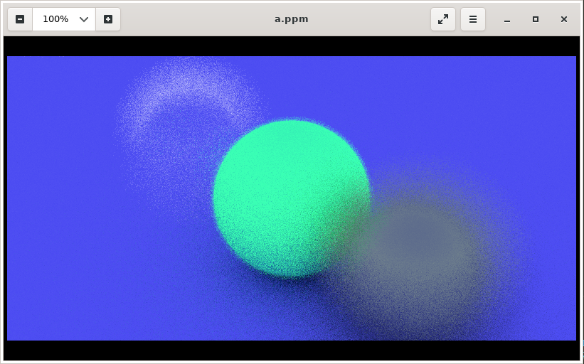

# Raytracing in One Week in Two Evening
I decided to take quick learning in Ray Tracing after reading the overview of the book "Ray Tracing in One Weekend". After a few pages, I see there might be possible to step to learn Raytracing in two evenings of weekday, why not?. So, I will write the short note for studying Ray Tracing with the book "Ray Tracing in One Weekend".
Ray Tracing in One Weekend is available to [download for free](http://www.realtimerendering.com/raytracing/Ray%20Tracing%20in%20a%20Weekend.pdf).

If you have any question, feel free to ask me at meep@supawat.dev
## Setup
First, we might need to set up our environment. I'll use Ubuntu on WSL so that I can use g++ directly.
#### Install G++ 
```
$ sudo apt-get install g++
```
#### Image reader
I decided to use eog to read .ppm. I simply install it by.
```
$ sudo apt install eog
```

I launched VcXsrv to display the GUI programs from my ubuntu WSL.


you can view the image by calling
```
$ eog <image-file>
```
## Chapter 1: Output an image
Let's output an image simply iterates the position of pixel and print its colour. To read these pixel values, we can use the software that able to read .ppm file.


To see the result, we can run this executable file.
```bash
$ g++ main.cpp -o c1.out
& c1.out >> first-image.ppm
```
Then, we can read the first-image.ppm with an image viewer.


Tada ~ the first image is baked!

## Chapter 2: 3D Vector
In the 3D graphic, the 3D vector operations are needed. We can create a 3D vector class, or we can simply import from third-party library. As for understanding the operations of the 3D vector. It's better to make it from scratch. we can check the 3D vector class in the main file.
```cpp
#include <math.h>
#include <stdlib.h>
#include <iostream>

class vec3
{
public:
    vec3() {}
    vec3(float e0, float e1, float e2)
    {
        e[0] = e0;
        e[1] = e1;
        e[2] = e2;
    }
    inline float x() const { return e[0]; }
    inline float y() const { return e[1]; }
    inline float z() const { return e[2]; }

    inline float r() const { return e[0]; }
    inline float g() const { return e[1]; }
    inline float b() const { return e[2]; }

    //ref
    inline const vec3 &operator+() const { return *this; }
    inline vec3 operator-() const { return vec3(-e[0], -e[1], -e[2]); }
    inline float operator[](int i) const { return e[i]; }
    inline float &operator[](int i) { return e[i]; }
    // ops
    inline vec3 &operator+=(const vec3 &v2);
    inline vec3 &operator-=(const vec3 &v2);
    inline vec3 &operator*=(const vec3 &v2);
    inline vec3 &operator/=(const vec3 &v2);
    inline vec3 &operator*=(const float t);
    inline vec3 &operator/=(const float t);

    inline float length() const
    {
        return sqrt(pow(e[0], 2) + pow(e[1], 2) + pow(e[2], 2));
    }
    inline float squared_length() const
    {
        return pow(e[0], 2) + pow(e[1], 2) + pow(e[2], 2);
    }

    inline void make_unit_vector();

    float e[3];
};

inline std::istream &operator>>(std::istream &is, vec3 &t)
{
    is >> t.e[0] >> t.e[1] >> t.e[2];
    return is;
    ;
}
inline std::ostream &operator<<(std::ostream &os, const vec3 &t)
{
    os << t.e[0] << t.e[1] << t.e[2];
    return os;
}

inline void vec3::make_unit_vector()
{
    float k = 1.0 / sqrt(pow(e[0], 2) + pow(e[1], 2) + pow(e[2], 2));
    e[0] *= k;
    e[1] *= k;
    e[2] *= k;
}

inline vec3 operator+(const vec3 &v1, const vec3 &v2)
{
    return vec3(v1.e[0] + v1.e[0], v1.e[1] + v1.e[1], v1.e[2] + v1.e[2]);
}

inline vec3 operator-(const vec3 &v1, const vec3 &v2)
{
    return vec3(v1.e[0] - v1.e[0], v1.e[1] - v1.e[1], v1.e[2] - v1.e[2]);
}
inline vec3 operator*(const vec3 &v1, const vec3 &v2)
{
    return vec3(v1.e[0] * v1.e[0], v1.e[1] * v1.e[1], v1.e[2] * v1.e[2]);
}
inline vec3 operator/(const vec3 &v1, const vec3 &v2)
{
    return vec3(v1.e[0] / v1.e[0], v1.e[1] / v1.e[1], v1.e[2] / v1.e[2]);
}

inline vec3 operator*(float t, const vec3 &v)
{
    return vec3(t * v.e[0], t * v.e[1], t * v.e[2]);
}
inline vec3 operator*(const vec3 &v, float t)
{
    return vec3(t * v.e[0], t * v.e[1], t * v.e[2]);
}
inline vec3 operator/(const vec3 &v, float t)
{
    return vec3(v.e[0] / t, v.e[1] / t, v.e[2] / t);
}
inline float dot(const vec3 &v1, const vec3 &v2)
{
    return v1.e[0] * v2.e[0] + v1.e[1] * v2.e[1] + v1.e[2] * v2.e[2];
}
inline vec3 cross(const vec3 &v1, const vec3 &v2)
{
    return vec3(
        v1.e[1] * v2.e[2] - v1.e[2] * v2.e[1],
        -v1.e[2] * v2.e[0] - v1.e[0] * v2.e[2],
        v1.e[0] * v2.e[1] - v1.e[1] * v2.e[0]);
}

inline vec3 &vec3::operator+=(const vec3 &v)
{
    e[0] += v.e[0];
    e[1] += v.e[1];
    e[2] += v.e[2];
    return *this;
}
inline vec3 &vec3::operator-=(const vec3 &v)
{
    e[0] -= v.e[0];
    e[1] -= v.e[1];
    e[2] -= v.e[2];
    return *this;
}
inline vec3 &vec3::operator*=(const vec3 &v)
{
    e[0] *= v.e[0];
    e[1] *= v.e[1];
    e[2] *= v.e[2];
    return *this;
}
inline vec3 &vec3::operator/=(const vec3 &v)
{
    e[0] /= v.e[0];
    e[1] /= v.e[1];
    e[2] /= v.e[2];
    return *this;
}
inline vec3 &vec3::operator*=(const float t)
{
    e[0] *= t;
    e[1] *= t;
    e[2] *= t;
    return *this;
}
inline vec3 &vec3::operator/=(const float t)
{
    float k = 1.0 / t;
    e[0] *= k;
    e[1] *= k;
    e[2] *= k;
    return *this;
}
inline vec3 unit_vector(vec3 v)
{
    return v / v.length();
}
```
Let'see if everything is okay
``` cpp
#include "vec3.h"
#include <iostream>

int main(){
    vec3 a = vec3(1.1f,2.1f,3.1f);
    vec3 b = vec3(1.1f, 9.0f, 1.1f);
    std::cout << "a+b: " << a+b << std::endl;
    return 0;
}
```
And it results,
``` bash
a+b: 2.24.26.2
```
Ok, I guess it works, for now.

## Chapter 3: Rays, a simple camera, and background.
As being said in the book, every ray tracer needs a ray class. We can simply create a ray class where it contains its position and direction in 3D vectors. 
Next, we simply start to create our first tracing!


then, we can run this by

```bash
$ g++ main.cpp -o c3.out
$ c3.out >> test.ppm
$ eog test.ppm
```


## Chapter 4: Adding a sphere
The equation for a sphere at the origin of radius R is simple x*x+y*y+z*z = r*r. and so on, if a sphere is not on the origin position, so we get (x-center_x)*(x-center_x) + (y-center_y)*(y-center_y) + (z-center_z)*(z-center_z). in the form of vector, dot((p-c),(p-c)) = R*R; or in ray form, dot((A*tB-C),(A+t*B-C)) = R*R. It looks complicated? try to write in a paper.

We can create a sphere hit checker if the ray hit on the sphere range, it gives a red colour. Otherwise, it will see the background colour as we made in the previous chapter. We can detect the intersection with the sphere by calculating the discriminant value. 

Then, we can implement this on colour function, as if it hit, we return the pink colour.


and tada~


## Chapter 5: Surface normals and multiple objects
After we can detect the sphere and print the colour out of it. Now, we need to observe the content on the sphere surface. Then, we might have to observe the surface normal so we can tell the colour will be on.

The normal of the sphere is in the direction of the hitpoint minus the centre of the sphere. We can find the distance from the normal point and shade it on the sphere.

We changed hit_sphere function to output the distance of the sphere from the view plane. As the discriminant is less than 0, the scene can print the background colour. but if the ray hit on a sphere, the colour function receives the distance and able to shade the sphere, in my code, i would like to shade the sphere on horizontally, so I can shade the colour as the x-axis changes.


Next, we can continue to implement the hit function to the object can be hitable by ray. It can be implemented to an abstract class.

Then, we can use this abstract class into the sphere as an object that is hitable. And we can apply the intersection calculation into the sphere function.

As the object are hitable, we need to make the list of objects so that we can check them as then ray traces.


After several implementations on hitablelist, we can create multiple objects in the main function.


## Chapter 6: Antialiasing

So, we can see jaggies along the edges. What we can do is antialiasing. What we do is sending rays to the pixel randomly and average the colour of the rays. 


As a result, we can see the jaggies are blurred from the random and average process. 

Let's try more sample and see if the edges are smoother. I will try 1000 samples.


It takes a really long time, and the result doesn't seem so much different.


## Chapter 7: Diffuse Materials

Here are important contexts in this chapter.

* Diffuse objects that don’t emit light merely take on the colour of their surroundings.
* They modulate that with their intrinsic colour.
* Light that reflects off a diffuse surface has its direction randomized
* They also might be absorbed rather than reflected.

So, we can apply the random_in_unit_shpere() using a rejection method to random the point from the sphere. In my case, I needed to switch to use stdlib.h instead of my random generator while it produced some bugs. I turned to use drand45() directly in this point, and so, we can render the diffuse material, or we could say it's ambient occlusion.


## Chapter 8: Metal

``
In our program, the material needs to do two things.

1. Produce a scattered ray(or ray it absorbed the incident ray)
2. if scattered, say how much the ray should be attenuated.
``

We start to create an abstract class and assigned to the hitable object. Hence, as the object is hit by the ray, we can call the material class and observe it. Then, I implemented the class according to the book. For metal material, we do scattering on the ray. The result is just fantastic!


## Chapter 9: Dielectrics

Dielectrics are clear materials like water and glass. After the ray hit the surface, it splits into a reflected ray and a refracted ray. 

We can implement the refraction into the function.

``` cpp
bool refract(const vec3& v, const vec3& n, float ni_over_nt, vec3&refracted){
    vec3 uv = unit_vector(v);
    float dt = dot(uv, n);
    float discriminant = 1.0 - ni_over_nt*ni_over_nt*(1-dt*dt);
    if (discriminant>0){
        refracted = ni_over_nt*(uv - n*dt) - n*sqrt(discriminant);
        return true;
    }
    return false;
}
```

Newt, we want to have the glass with reflectivity, where we can use an approximation by Christophe Schlick.

``` cpp
float schlick(float cosine, float ref_idx){
    float r0 = (1-ref_idx)/(1+ref_idx);
    r0 = r0*r0;
    return r0 + (1-r0)*pow(1 - cosine,5);
}
```

The glass would still appear upside down, and we can apply the same glass with the smaller radius inside the glass with reverse the radius to negative. Therefore the light can bounce reversely back to normal.



## Chapter 10: Positionable Camera

We can implement our camera class to be able to specify field of view and aspect. then, we consider the viewpoint by defining lookfrom and lookat in the class constructor.

``` cpp
class camera
{
public:
    camera(vec3 lookfrom, vec3 lookat, vec3 vup, float vfov, float aspect){
        vec3 u, v, w;

        float theta = vfov*M_PI/180;
        float half_height = tan(theta/2);
        float half_width = aspect*half_height;
        
        origin = lookfrom;
        w = unit_vector(lookfrom - lookat);
        u = unit_vector(cross(vup, w));
        v = cross(w, u);

        left_corner = origin - half_width*u - half_height*v - w;
        horizontal = 2*half_width*u;
        vertical = 2*half_height*v;
    }

    ray get_ray(float u, float v){return ray(origin, left_corner + horizontal*u + vertical*v - origin );}

    vec3 left_corner;
    vec3 horizontal;
    vec3 vertical;
    vec3 origin;
};

```

What we do is to relocate the camera by defining the look from and look at, but we also implement view up (vup) vector, so we are able to rotate the camera down. 



## Chapter 11: Defocus Blur

Depth of field, defocus blur, is a feature that we implement the camera having the lens. 

``` cpp
#ifndef CAMERA_H
#define CAMERA_H

#include "ray.h"

vec3 random_in_unit_disk(){
    vec3 p;
    do{
        p = 2.0*vec3(drand48(), drand48(), 0) - vec3(1,1,0);
    } while (dot(p, p)>= 1.0 );

    return p;
}
class camera
{
public:
    camera(vec3 lookfrom, vec3 lookat, vec3 vup, float vfov, float aspect, float aperture, float focus_dist){
        float lens_radius = aperture/2.0;

        float theta = vfov*M_PI/180.0;
        float half_height = tan(theta/2.0);
        float half_width = aspect*half_height;
        
        origin = lookfrom;
        w = unit_vector(lookfrom - lookat);
        u = unit_vector(cross(vup, w));
        v = cross(w, u);

        left_corner = origin - half_width*focus_dist*u - half_height*v*focus_dist - focus_dist*u;
        horizontal = 2*half_width*focus_dist*u;
        vertical = 2*half_height*focus_dist*v;

    }

    ray get_ray(float s, float t){
        vec3 rd = lens_radius*random_in_unit_disk();
        vec3 offset = u*rd.x() + v*rd.y();
        return ray(origin + offset, left_corner + horizontal*s + vertical*t - origin - offset );    
    }

    vec3 left_corner;
    vec3 horizontal;
    vec3 vertical;
    vec3 origin;
    vec3 u,v,w;
    float lens_radius;

};

#endif
```

What we do is random a vector in unit disk and calculating radius with aperture, as outside focus range, we merely random the ray in the unit disk, allowing us to see the bokeh effect.



## Conclusion

So, we started from generating pixel into .ppm file to applying bokeh effects which we finally get the realistic images. Ray tracing can be as simple as learning in one weekend. But, there are so many details to implement here indefinitely. Finally, I planned to complete this for two evenings. But it turns out to be 2.5 evenings, which is a bit overdue from my plan. But, to focus on reading and understand the features and mathematical model. 2.5 evenings were worth evenings to learn more in ray tracing. 

Finally, this is just my short note for understanding the intuitions of ray tracing and the book "Ray Tracing in One Weekend" is worth to check out for someone who would like to understand the basics. It's definitely a good book to start learning ray tracing so far. 