# Raytracing in One Week in Two Evening
I decided to take a quick learning in Ray Tracing after reading the overview of the book "Ray Tracing in One Weekend". After a few pages, I see there might be possible to step to learn Raytracing in two evening of weekday, why not?. So, I will write the short note for studyung Ray Tracing with the book Ray Tracing in One Weekend.
Ray Tracing in One Weekend are available to [download for free](http://www.realtimerendering.com/raytracing/Ray%20Tracing%20in%20a%20Weekend.pdf).

If you have any question, feel free to ask me at meep@supawat.dev
## Setup
First, we might need to set up our environment. I'll use ubuntu on WSL, so that I can use g++ directly.
#### Install G++ 
```
$ sudo apt-get install g++
```
#### Image reader
I decided to use eog to read .ppm. I simply install it by using
```
$ sudo apt install eog
```
I launched VcXsrv to display the GUI programs from my ubuntu wsl.


you can view the image by calling
```
$ eog <image-file>
```
## Chapter 1: Output an image
Let's output an image simply iterates the position of pixel and print its color. to read these pixel values, we can use the software that able to read .ppm file.

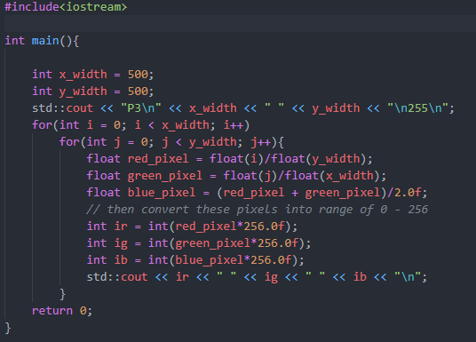

To see the result, we can run this executable file.
```bash
$ g++ main.cpp -o c1.out
& c1.out >> first-image.ppm
```
Then, we can read the first-image.ppm with a image viewer.

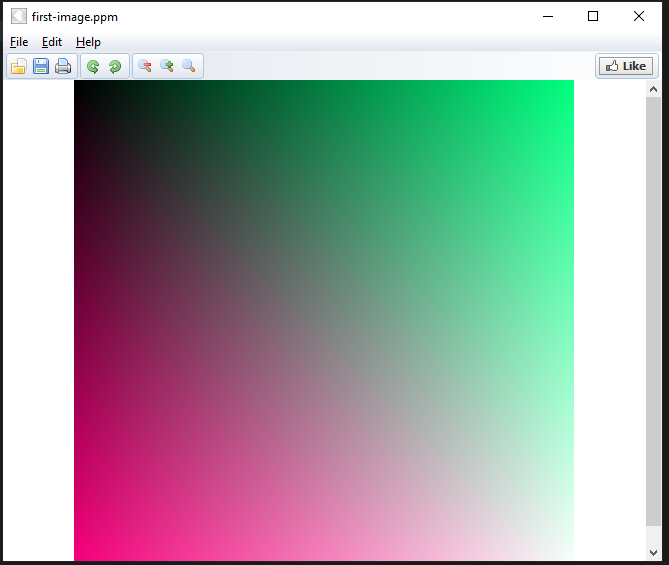

tada~ the first image is baked!

## Chapter 2: 3D Vector
In 3D graphic, the 3D vector operations will be much used. we can create a 3D vector class, or we can simply import from third part library. As for understanding the operations of 3D vector. It's better to make it from scratch. we can check the 3D vector class in the main file.
```cpp
#include <math.h>
#include <stdlib.h>
#include <iostream>

class vec3
{
public:
    vec3() {}
    vec3(float e0, float e1, float e2)
    {
        e[0] = e0;
        e[1] = e1;
        e[2] = e2;
    }
    inline float x() const { return e[0]; }
    inline float y() const { return e[1]; }
    inline float z() const { return e[2]; }

    inline float r() const { return e[0]; }
    inline float g() const { return e[1]; }
    inline float b() const { return e[2]; }

    //ref
    inline const vec3 &operator+() const { return *this; }
    inline vec3 operator-() const { return vec3(e[0], -e[1], -e[2]); }
    inline float operator[](int i) const { return e[i]; }
    inline float &operator[](int i) { return e[i]; }
    // ops
    inline vec3 &operator+=(const vec3 &v2);
    inline vec3 &operator-=(const vec3 &v2);
    inline vec3 &operator*=(const vec3 &v2);
    inline vec3 &operator/=(const vec3 &v2);
    inline vec3 &operator*=(const float t);
    inline vec3 &operator/=(const float t);

    inline float length() const
    {
        return sqrt(pow(e[0], 2) + pow(e[1], 2) + pow(e[2], 2));
    }
    inline float squared_length() const
    {
        return pow(e[0], 2) + pow(e[1], 2) + pow(e[2], 2);
    }

    inline void make_unit_vector();

    float e[3];
};

inline std::istream &operator>>(std::istream &is, vec3 &t)
{
    is >> t.e[0] >> t.e[1] >> t.e[2];
    return is;
    ;
}
inline std::ostream &operator<<(std::ostream &os, const vec3 &t)
{
    os << t.e[0] << t.e[1] << t.e[2];
    return os;
}

inline void vec3::make_unit_vector()
{
    float k = 1.0 / sqrt(pow(e[0], 2) + pow(e[1], 2) + pow(e[2], 2));
    e[0] *= k;
    e[1] *= k;
    e[2] *= k;
}

inline vec3 operator+(const vec3 &v1, const vec3 &v2)
{
    return vec3(v1.e[0] + v1.e[0], v1.e[1] + v1.e[1], v1.e[2] + v1.e[2]);
}

inline vec3 operator-(const vec3 &v1, const vec3 &v2)
{
    return vec3(v1.e[0] - v1.e[0], v1.e[1] - v1.e[1], v1.e[2] - v1.e[2]);
}
inline vec3 operator*(const vec3 &v1, const vec3 &v2)
{
    return vec3(v1.e[0] * v1.e[0], v1.e[1] * v1.e[1], v1.e[2] * v1.e[2]);
}
inline vec3 operator/(const vec3 &v1, const vec3 &v2)
{
    return vec3(v1.e[0] / v1.e[0], v1.e[1] / v1.e[1], v1.e[2] / v1.e[2]);
}

inline vec3 operator*(float t, const vec3 &v)
{
    return vec3(t * v.e[0], t * v.e[1], t * v.e[2]);
}
inline vec3 operator*(const vec3 &v, float t)
{
    return vec3(t * v.e[0], t * v.e[1], t * v.e[2]);
}
inline vec3 operator/(const vec3 &v, float t)
{
    return vec3(v.e[0] / t, v.e[1] / t, v.e[2] / t);
}
inline float dot(const vec3 &v1, const vec3 &v2)
{
    return v1.e[0] * v2.e[0] + v1.e[1] * v2.e[1] + v1.e[2] * v2.e[2];
}
inline vec3 cross(const vec3 &v1, const vec3 &v2)
{
    return vec3(
        v1.e[1] * v2.e[2] - v1.e[2] * v2.e[1],
        -v1.e[2] * v2.e[0] - v1.e[0] * v2.e[2],
        v1.e[0] * v2.e[1] - v1.e[1] * v2.e[0]);
}

inline vec3 &vec3::operator+=(const vec3 &v)
{
    e[0] += v.e[0];
    e[1] += v.e[1];
    e[2] += v.e[2];
    return *this;
}
inline vec3 &vec3::operator-=(const vec3 &v)
{
    e[0] -= v.e[0];
    e[1] -= v.e[1];
    e[2] -= v.e[2];
    return *this;
}
inline vec3 &vec3::operator*=(const vec3 &v)
{
    e[0] *= v.e[0];
    e[1] *= v.e[1];
    e[2] *= v.e[2];
    return *this;
}
inline vec3 &vec3::operator/=(const vec3 &v)
{
    e[0] /= v.e[0];
    e[1] /= v.e[1];
    e[2] /= v.e[2];
    return *this;
}
inline vec3 &vec3::operator*=(const float t)
{
    e[0] *= t;
    e[1] *= t;
    e[2] *= t;
    return *this;
}
inline vec3 &vec3::operator/=(const float t)
{
    float k = 1.0 / t;
    e[0] *= k;
    e[1] *= k;
    e[2] *= k;
    return *this;
}
inline vec3 unit_vector(vec3 v)
{
    return v / v.length();
}
```
Let'see if everything is okay
``` cpp
#include "vec3.h"
#include <iostream>

int main(){
    vec3 a = vec3(1.1f,2.1f,3.1f);
    vec3 b = vec3(1.1f, 9.0f, 1.1f);
    std::cout << "a+b: " << a+b << std::endl;
    return 0;
}
```
And it results,
``` bash
a+b: 2.24.26.2
```
Ok, I guess it works, for now.

## Chapter 3: Rays, a simple camera, and background.
As being said in the book, every ray tracer needs a ray class. we can simply create a ray class where it contains its position and direction in 3D vectors. 
Next, we simply start to create our first tracing!

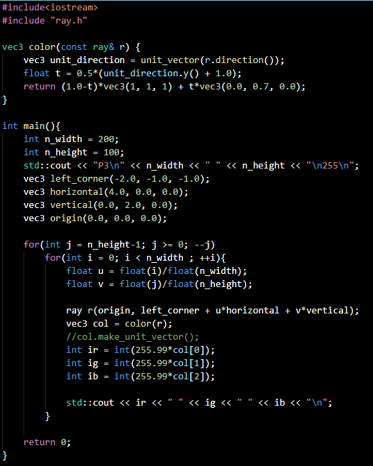

then, we can run this by

```bash
$ g++ main.cpp -o c3.out
$ c3.out >> test.ppm
$ eog test.ppm
```

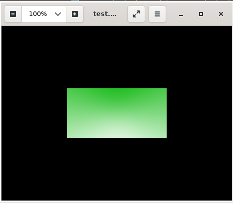

## Chapter 4: Adding a sphere
The equation for a sphere at the origin of radius R is simple x*x+y*y+z*z = r*r. and so on, if a sphere is not on the origin position, so we get (x-center_x)*(x-center_x) + (y-center_y)*(y-center_y) + (z-center_z)*(z-center_z). in the form of vector, dot((p-c),(p-c)) = R*R; or in ray form, dot((A*tB-C),(A+t*B-C)) = R*R. It looks complicated? try to write in a paper.

We can create a sphere hit checker, if the ray hit on the sphere range, it give a red color, otherwise, it will see the background color as we made in previous chapter. We can detect the interesction with the sphere by calculating the discriminant value. 

Then, we can implement this on color function, as if it hit, we return pink color.

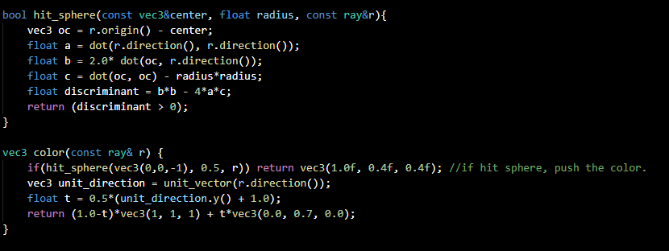

and tada~

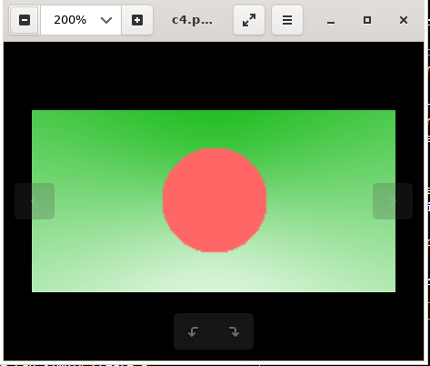

## Chapter 5: Surface normals, and mulitple objects
After we can detect the sphere and print the colur out of it. now, we need to obseve the content on the sphere surface. then, we might have to observe the surface normal so we can tell the color will be on.

the normal of the sphere is in the direction of the hitpoint minus the center of the sphere. we can find the distance from normal point and shade it on the sphere.

we changed hit_sphere function to output the distance of the sphere from the view plane. As the discriminant is less than 0, the scence can print the background color. but if the ray hit on sphere, the color fucntion receive the distance and able to shade the sphere, in my code, i would like to shade the sphere on harizontally, so I can shade the color as the x-axis changes.
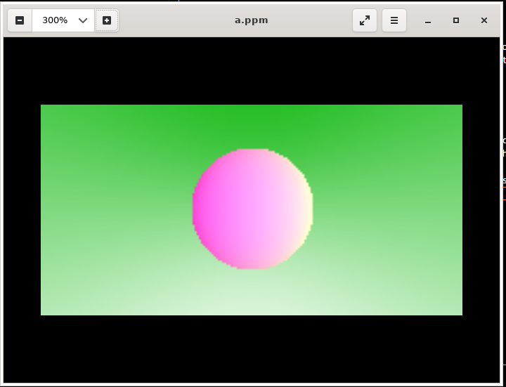

next, we can continue on implement the hit function to the object can be hitable by ray. it can be implement to an abstract class.

then, we can use this abstract class into the sphere as object that is hitable. and we can apply the intersection calculation into the sphere function.

as the object are hitable, we need to make the list of object, so we can check them as then ray traces.

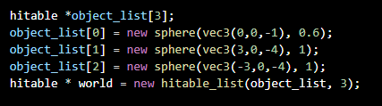

After serveral implementations on hitablelist, we are able to create multiple objects in the main function.

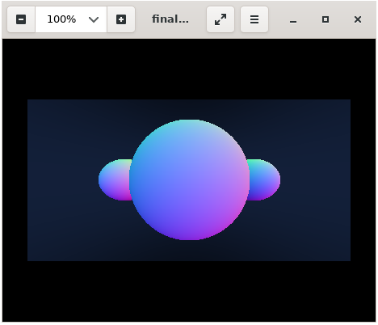

## Chapter 6: Antialiasing

so, we can see jaggies aloung the edges, what we can do is antialiasing. what we do is sending rays to the pixel randomly and average the color of the rays. 

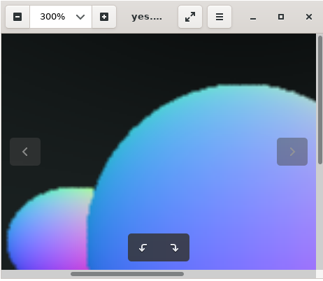

As the result, we can see the jaggies are not blurred from the random and average process. 

Let's try more sample, and see if the edges are smoother. I will try 1000 samples.

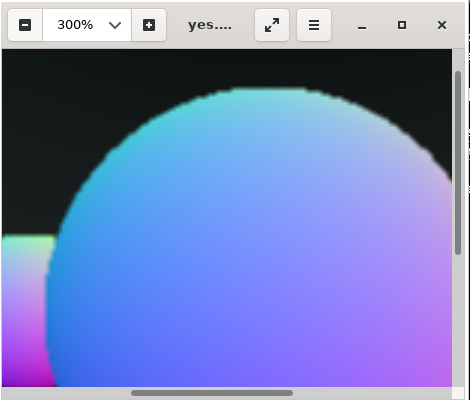

It takes really long time, and the result doesnt seem so much different.

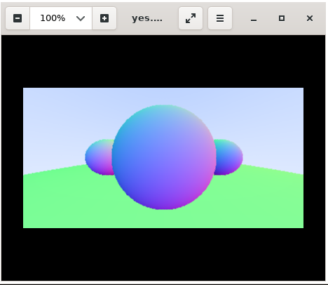

## Chapter 7: Diffuse Materials

Here are important contexts in this chapter.

* Diffuse objects that don’t emit light merely take on the color of their surroundings.
* They modulate that with their own intrinsic color.
* Light that reflects off a diffuse surface has its direction randomized
* They also might be absorbed rather than reflected.

So, we can apply the random_in_unit_shpere() using rejection method to random the point from the sphere. in my case, I needed to switch to use stdlib.h instead of my own random generator while it produced some bugs. I switched to use drand45() directly in this point, and so, we are able to render the diffuse material, or we could say it's ambient occlusion.

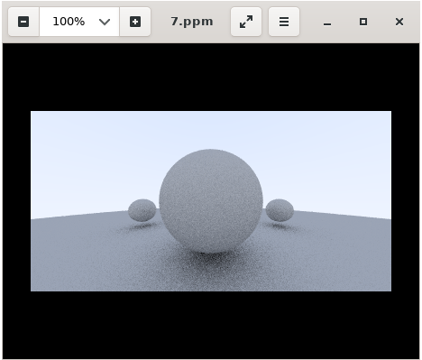

## Chapter 8: Metal

``
In our program, the material needs to do two things.

1. Produce a scattered ray(or ray it absorbed the incident ray)
2. if scattered, say how much the ray should be attenuated.
``

We start create an abstract class and assigned to the hitable object. hence, as the object is hit by the ray, we are able to call the material class and observe it. then, i implemented the class according to the book. for metal material, we do scattering on the ray. the result is just amazing!

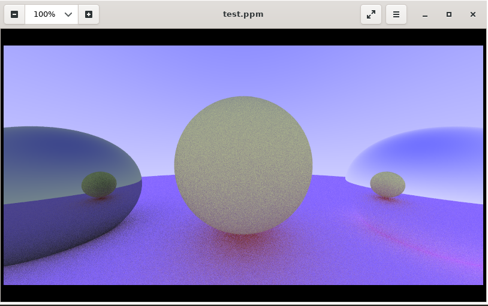